# MTG Draft Night

[](https://github.com/dylanleatham/DraftNight/actions/workflows/ci.yml)

A mobile-first web app for running in-person **Magic: The Gathering booster drafts** for 2–8 players. The host creates an event and friends join from their phones with a six-character code. From there the app runs the night: pairings, results, live standings, prize-pack allocation, and a pixel-art life tracker for each match.

Every phone stays in sync in real time over SignalR. All tournament logic sits in a **pure, deterministic engine** that is verified by golden tests for every supported player count.

<p align="center">
  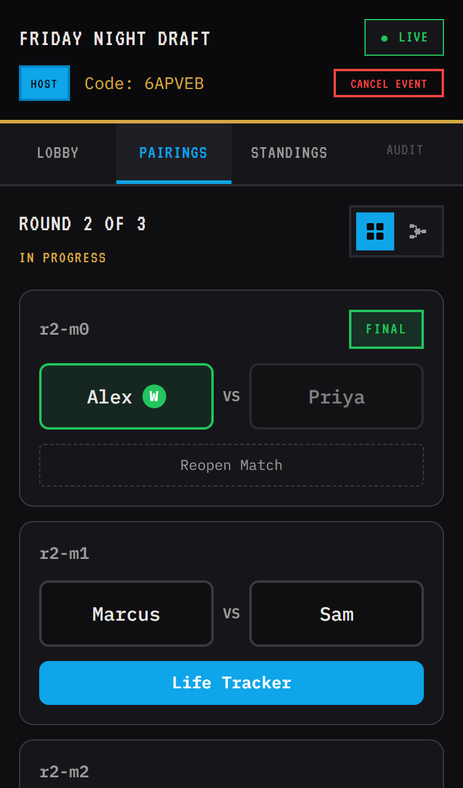
  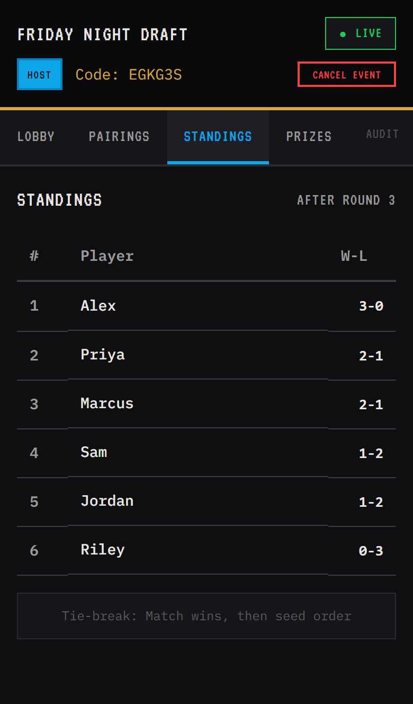
  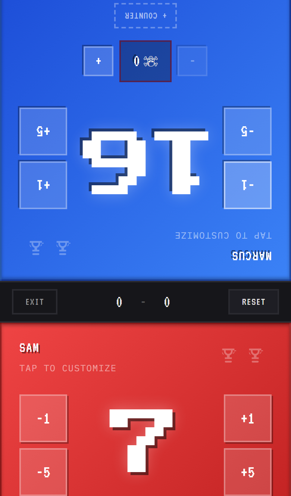
  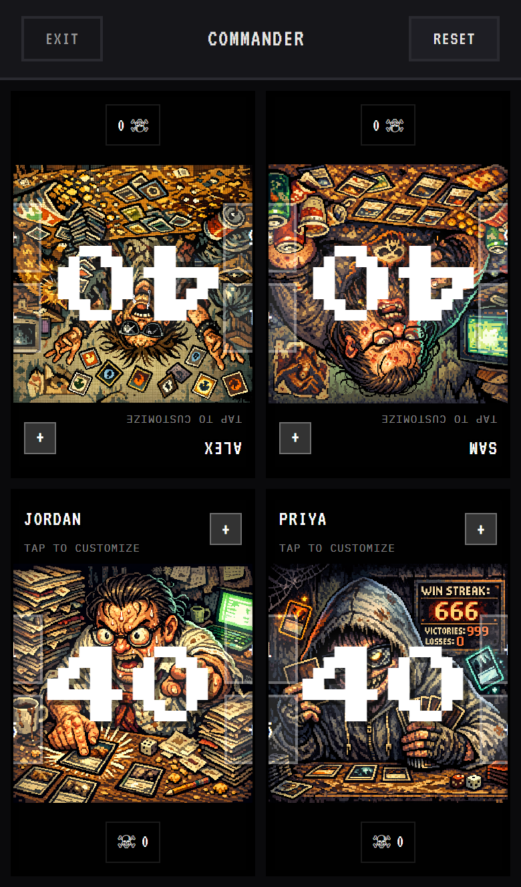
</p>

> **Status:** This is a personal project. It ran on Azure (Static Web Apps, App Service, SignalR Service, Azure SQL), and later as a single container on Azure Container Apps. That subscription has been retired, so there is no live demo. The whole stack runs locally with one command (see [Run it locally](#run-it-locally)).

---

## What it does

| | |
|---|---|
| **Event lobby** | The host creates an event with a PIN and the box size. Players join with a code or a shared link, and the host can drop players before the start. |
| **Rejoin on any device** | If a phone dies, its owner can reclaim their seat with the join code, name and PIN, and the old device is signed out. The host's PIN also restores host controls. |
| **Automatic format** | The format is chosen by player count: round-robin for 2–4 players (circle method), 3-round **Swiss** for 5–8 players (repeat-avoiding pairings). |
| **Results & standings** | The host or either player reports the winner. Standings update live on every connected device, and ties break deterministically. |
| **Prize packs** | Prize packs are `P = packs in box − 3 × players`. Each match win earns one pack. When there aren't enough, later-round winners get priority. |
| **Host repair tools** | The host can reopen a match or a whole round, swap opponents, or regenerate pairings. Each repair requires a reason and is recorded in the audit log. |
| **Life tracker** | A 1v1 tracker opens from a match. A standalone mode supports 2–4 players at 20/30/40 life, with poison counters, character portraits and custom colors. It works offline as a PWA. |
| **Resilience** | Optimistic concurrency stops two phones from overwriting each other, and clients resync a full snapshot when they reconnect. |

<details>
<summary><b>More screenshots</b></summary>
<br>
<p align="center">
  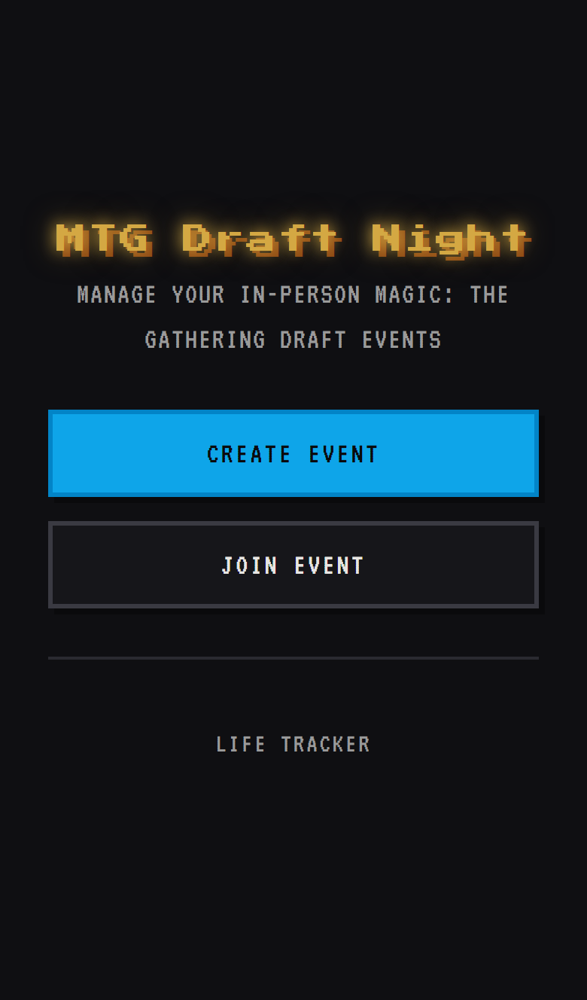
  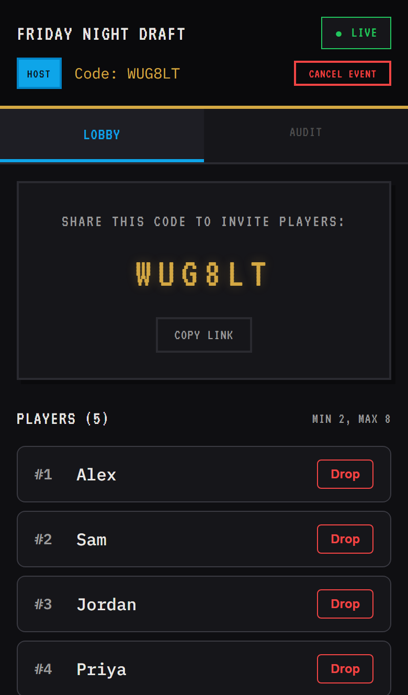
  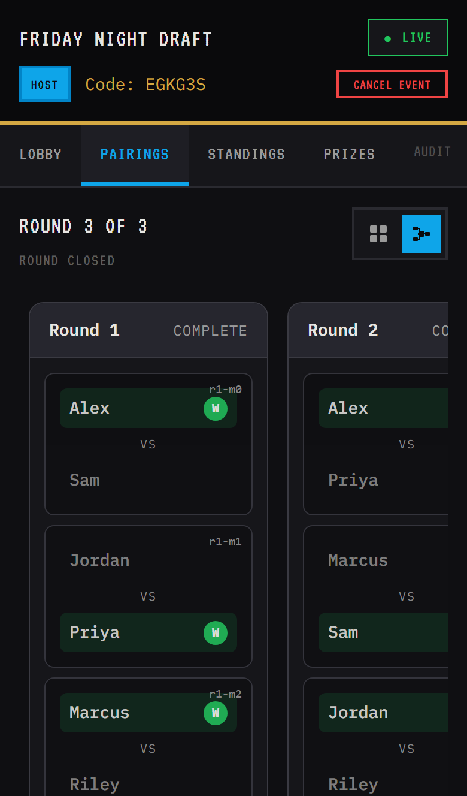
  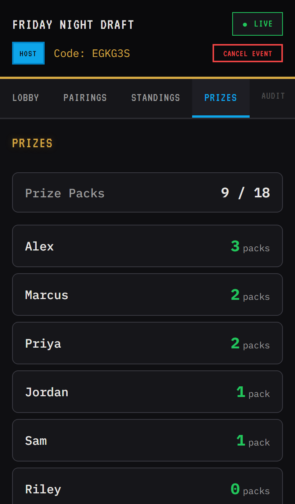
</p>
<p align="center">
  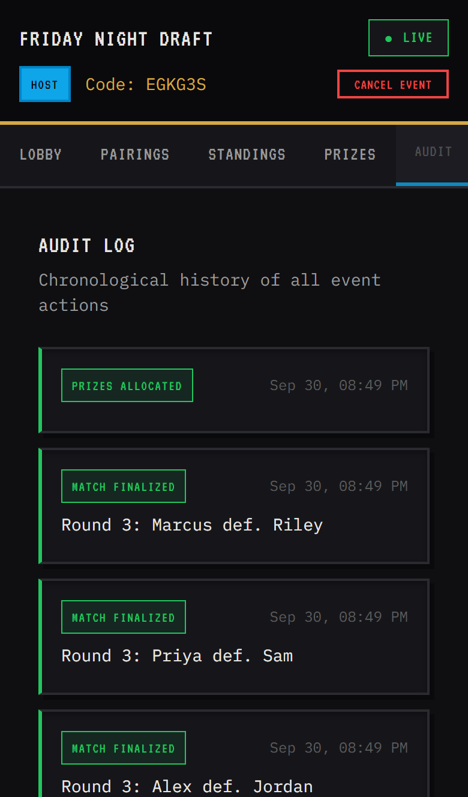
  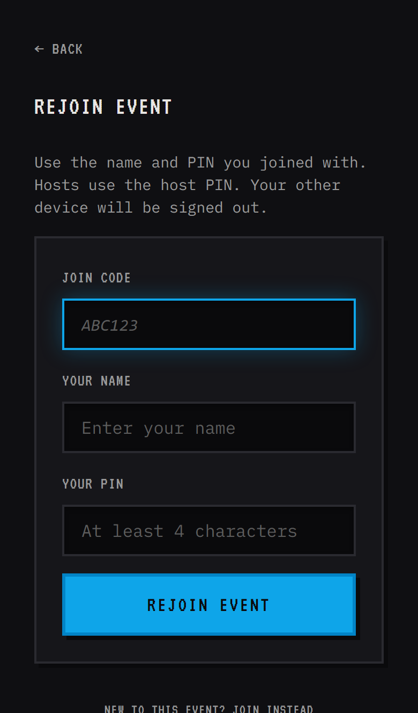
</p>
</details>

---

## Run it locally

**Prerequisites:** Docker and Node 18+.

```bash
docker compose up --build
```

This starts SQL Server and builds a single image containing the API and the React app. Open **http://localhost:8080** (the database takes about 20 seconds on first start).

### Load demo data

Running a draft normally takes several phones. The seed script plays a realistic event through the public REST API instead:

```bash
node scripts/seed-demo.mjs                    # 6-player Swiss event, all 3 rounds played, prizes allocated
node scripts/seed-demo.mjs --stage=round2     # stop mid-event with round 2 in progress
node scripts/seed-demo.mjs --stage=lobby      # players joined, event not yet started
node scripts/seed-demo.mjs --players=4        # 2–8 players (4 or fewer = round-robin)
```

The script prints the event URL and a one-line `localStorage` snippet. Paste the snippet into the browser devtools console to view the event as the host. To try the real multi-device flow instead, create an event in one browser and join it from a private window or a phone on the same network.

---

## Architecture

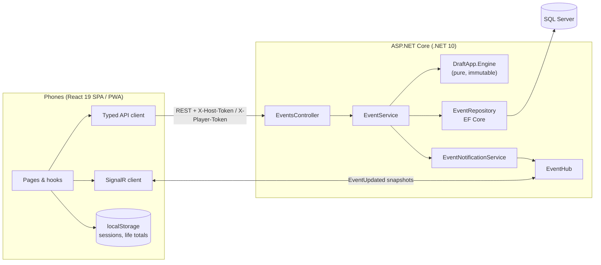

**Request lifecycle for a mutation** (for example, finalizing a match):

1. The controller authorizes the call. Host-only actions check `X-Host-Token`. Reporting a result also accepts the `X-Player-Token` of either player in that match.
2. The service loads the event, maps it to an immutable `EventState`, and calls a pure engine function such as `TournamentEngine.FinalizeMatch(state, round, matchId, winnerId)`.
3. The engine returns either a new state or a typed error. It never throws for rule violations.
4. The repository writes the new state together with an audit log row in a single `SaveChanges`. The `WHERE Version = expected` concurrency check means a stale client gets `409 Conflict` rather than a lost update.
5. A full snapshot goes to everyone in the event's SignalR group.

### Engineering highlights

- **Pure tournament engine.** `DraftApp.Engine` has no I/O, no clock and no randomness. Every operation (`InitializeEvent`, `GenerateRoundPairings`, `FinalizeMatch`, `DropPlayer`, `AllocatePrizes`, plus the repair operations) is a function from immutable state to a result. That makes the rules easy to test in isolation and guarantees that the same inputs always produce the same bracket.
- **Spec-driven, golden-tested.** The rules are written as a normative spec: [`docs/draft_bracket_and_prizes.spec.md`](docs/draft_bracket_and_prizes.spec.md). Golden test files for N = 2 through 8 (plus a limited-prize scenario) fix the exact pairings, standings and prize output. Any change to engine output must update the goldens, and the diff has to justify itself.
- **Deterministic tie-breaks everywhere.** Match wins descending, then seed ascending, then player ID ascending. The same ordering drives pairings, BYE assignment and prize priority.
- **Optimistic concurrency end to end.** Every mutation carries `expectedVersion`. The version column is an EF Core concurrency token. The frontend reads the latest version right before each action, which keeps the conflict window small.
- **Lightweight auth fit for the use case.** There are no accounts. Host and player tokens are 256-bit values from a CSPRNG, and only their SHA-256 hashes are stored, so a database leak exposes no usable sessions. PINs are hashed with PBKDF2-SHA256 using a per-PIN salt and are checked only by the rate-limited rejoin endpoint. Join codes use an unambiguous alphabet with no modulo bias.
- **Integration tests on a real relational engine.** API tests host the app in `WebApplicationFactory` against in-memory SQLite, so transactions, raw SQL and concurrency tokens behave as they would in production. The SignalR tests connect real hub clients.

---

## Tests

| Suite | Count | What it covers |
|---|---:|---|
| `DraftApp.Engine.Tests` | 181 | Round-robin scheduling, Swiss pairing and repeat avoidance, BYEs, drops, prize allocation, repair operations, golden files for N = 2–8 |
| `DraftApp.Api.Tests` | 72 | Endpoint authorization, validation, version conflicts, token hashing, rejoin and rate limiting, audit details, repository persistence, SignalR broadcast and reconnect/resync |
| Frontend (Vitest) | 106 | Life tracker and Commander hooks, host and player action hooks, join and rejoin page, audit descriptions, notifications, storage, UI components |
| Frontend (Playwright) | E2E | Full host and player flow across multiple browser contexts |

```bash
dotnet test src/backend                     # all backend tests (no database needed)
npm run test:run --prefix src/frontend      # unit tests
npm run e2e --prefix src/frontend           # E2E; needs the app running
```

CI ([`.github/workflows/ci.yml`](.github/workflows/ci.yml)) runs format checks (`dotnet format`, Prettier), ESLint, both builds, and all unit and integration tests on every push and pull request.

---

## Development setup

To use hot reload instead of the container:

```bash
docker compose up -d sqlserver              # just the database
dotnet run --project src/backend/DraftApp.Api   # API on http://localhost:5244 (applies migrations)
npm install --prefix src/frontend
npm run dev --prefix src/frontend           # Vite on http://localhost:5173, proxies /api and /hubs
```

In Development the OpenAPI document is served at `http://localhost:5244/openapi/v1.json`.

| Setting | Purpose | Default |
|---|---|---|
| `ConnectionStrings__DefaultConnection` | SQL Server connection | Local container (see `appsettings.Development.json`) |
| `ConnectionStrings__AzureSignalR` | Optional: use Azure SignalR Service instead of in-process SignalR | unset |
| `AllowedOrigins` | CORS origins, only needed if the SPA is served from another origin | `localhost:5173` in Development |
| `MSSQL_SA_PASSWORD` | Password for the local SQL Server container | throwaway dev value (see `.env.example`) |

---

## Project structure

```
src/
├── backend/
│   ├── DraftApp.Engine/          # Pure tournament engine: models, scheduler, Swiss pairer, prize allocator, typed errors
│   ├── DraftApp.Engine.Tests/    # Unit and golden tests (Golden/TestCases/*.json)
│   ├── DraftApp.Api/             # ASP.NET Core API: controllers, services, EF Core, SignalR hub
│   └── DraftApp.Api.Tests/       # Integration tests (WebApplicationFactory + SQLite, SignalR clients)
└── frontend/                     # React 19 + TypeScript + Vite SPA/PWA
    ├── src/{pages,components,hooks,context,api,lib}
    └── e2e/                      # Playwright specs
scripts/seed-demo.mjs             # Demo data generator (uses the public REST API)
docs/
├── spec.md                       # Product specification
├── draft_bracket_and_prizes.spec.md  # Normative tournament and prize rules
├── design.md                     # Architecture and design decisions
├── host-guide.md                 # How to run a draft night with the app
└── backlog.md                    # The epic-by-epic build plan the project followed
```

## Tech stack

**Backend:** .NET 10, ASP.NET Core, Entity Framework Core (SQL Server), SignalR, xUnit, StyleCop analyzers with warnings as errors.
**Frontend:** React 19, TypeScript, React Router 7, Vite, CSS Modules, vite-plugin-pwa, Vitest, Testing Library, Playwright.
**Tooling:** Docker multi-stage build, GitHub Actions CI, Prettier, ESLint.

## License

[MIT](LICENSE)
